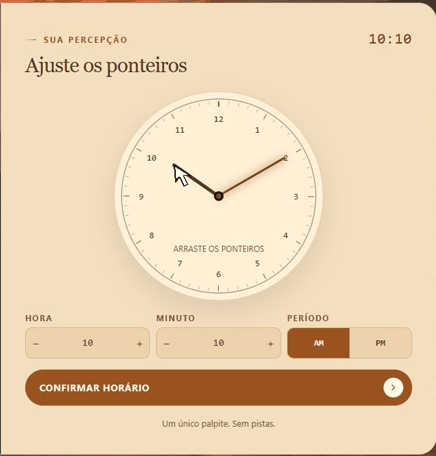
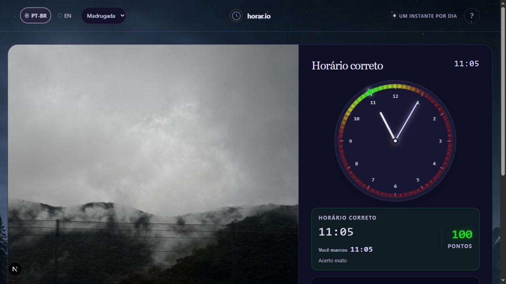
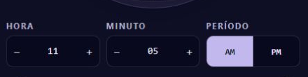
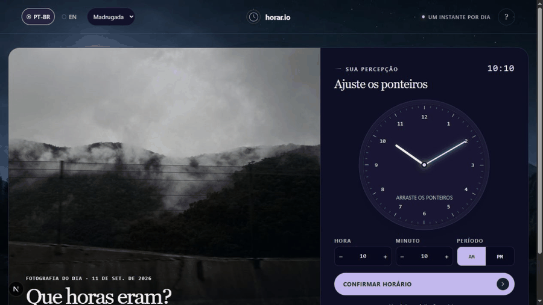
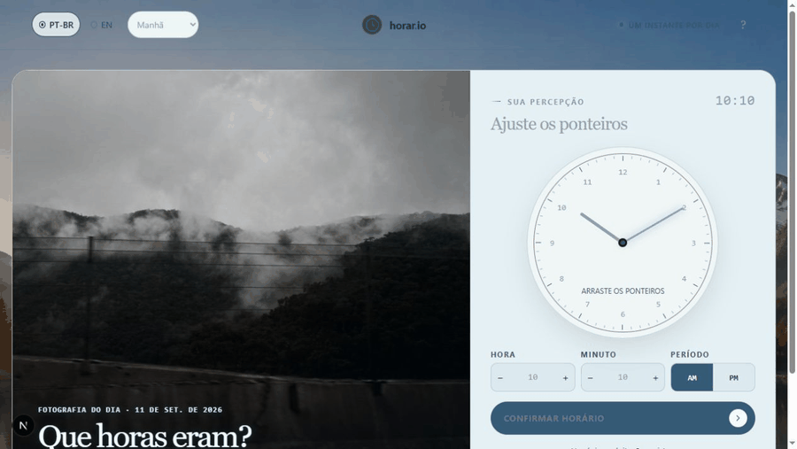
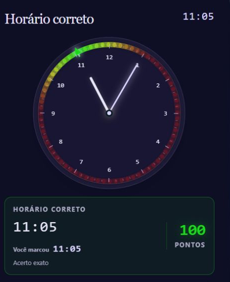

# Horar.io

**Observe. Sinta. Confie na sua intuição.**

## Intuição e sorte

Horar.io é um jogo diário de adivinhação. Observe atentamente a fotografia, interprete os detalhes da cena e tente descobrir em que horário ela foi registrada.

Uma fotografia é disponibilizada por dia. O catálogo de 50 fotos reais se repete automaticamente ao terminar, mantendo o desafio diário sem necessidade de reposição manual. As fontes, licenças e horários registrados pelas câmeras estão no [catálogo de fotografias](photo-library/sky/CATALOGO.md).

  

## Sobre o projeto

Horar.io nasceu de uma ideia original e foi desenvolvido para proporcionar um momento simples e divertido ao longo do dia.

Observe, confie na sua intuição e tente alcançar a melhor colocação no ranking diário!

  

## Características de jogabilidade

O jogador pode definir seu palpite utilizando um relógio analógico interativo, ajustando diretamente os ponteiros de horas e minutos.

  

Para quem prefere maior precisão, também é possível informar o horário por meio dos controles numéricos.

  

A seção **Como jogar**, acessível pelo botão **?** no canto superior direito da tela, apresenta um tutorial interativo sobre o funcionamento do relógio e explica as principais regras do jogo.

  

## Visual

O site conta com quatro temas visuais inspirados nos diferentes períodos do dia: **Manhã**, **Tarde**, **Noite** e **Madrugada**. No modo **Interativo**, a aparência é alterada automaticamente de acordo com o horário real; também é possível manter qualquer um dos temas de forma permanente.

  

A interface está disponível em **Português do Brasil (PT-BR)** e **Inglês (EN)**.

## Demais mecânicas

Após o envio do palpite, o horário exato da fotografia é revelado e a pontuação é calculada com base na diferença entre os dois horários. Um acerto exato vale **100 pontos**. A pontuação diminui gradualmente conforme a distância aumenta e chega a zero quando o palpite está a duas horas ou mais do horário correto. O cálculo sempre considera o menor intervalo dentro de um ciclo de 24 horas, inclusive quando a diferença atravessa a meia-noite.

  

O resultado também apresenta a colocação do jogador no ranking diário. Empates compartilham a mesma posição, e o ranking é atualizado ao longo do dia.

A interface informa quanto tempo falta para a próxima fotografia, liberada à meia-noite no horário de Brasília, e mantém uma sequência com o número de dias consecutivos em que o jogador participou do desafio.

## Programação

O Horar.io foi desenvolvido principalmente em **TypeScript**, utilizando **Next.js** e **React** na construção da interface. A apresentação visual combina **CSS** e **Tailwind CSS**, enquanto o **Convex** oferece a infraestrutura de backend, armazenamento e atualização dos dados em tempo real.

O projeto também utiliza **JavaScript** em ferramentas auxiliares, como o processo de preparação e importação das fotografias.

---

Desenvolvido por **Lavaley**

